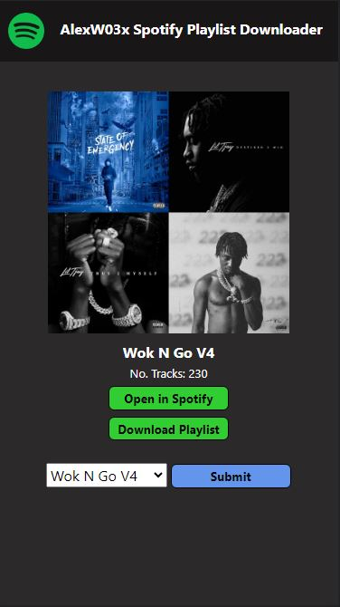

# Flask-Spotify-Python
> This is a small project I decided to do to further improve my skills with python and it involved using a module called Flask to help me make the python script work with HTML and transfer data across the two different languages.

# How does it work?
> The project works by utilising spotify API from a module called spotipy and fetches data from the playlists to allow for users to download the songs from the browser by selecting through the playlists.

# Prerequisites
```python
py -m pip install pytube
py -m pip install Flask
py -m pip install spotipy
py -m pip install moviepy
py -m pip install mutagen
```

# Screenshots


